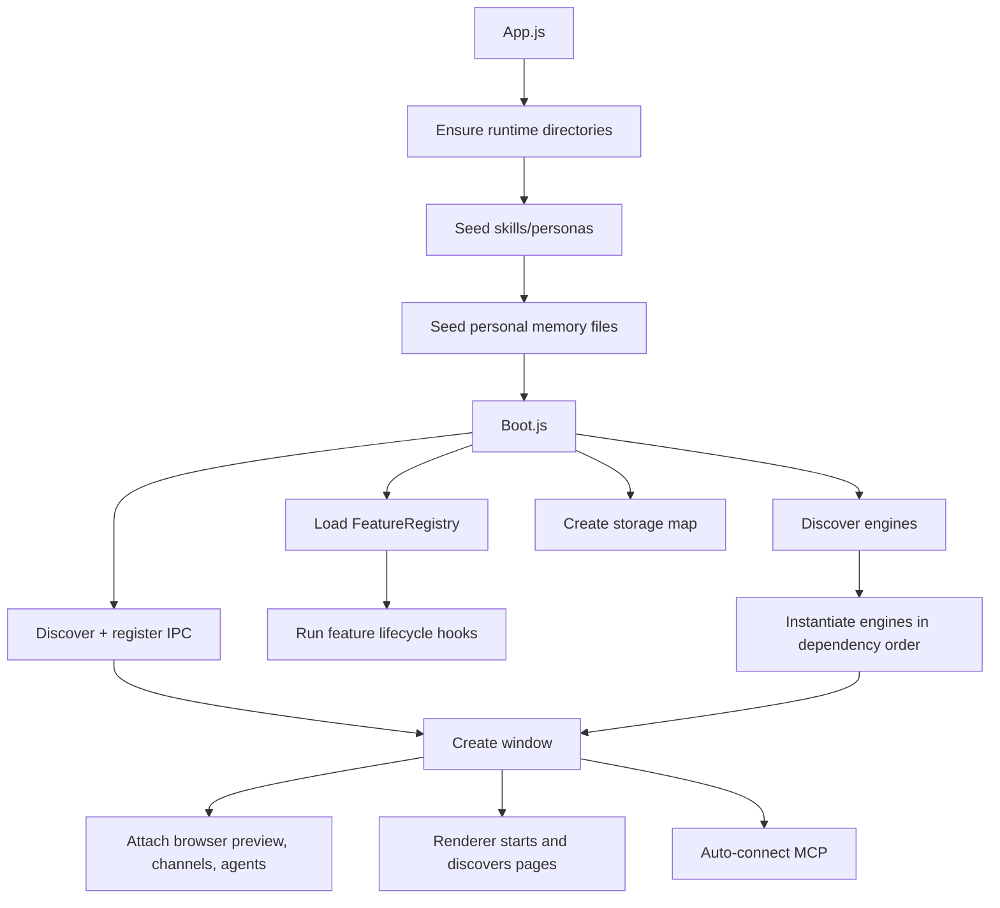
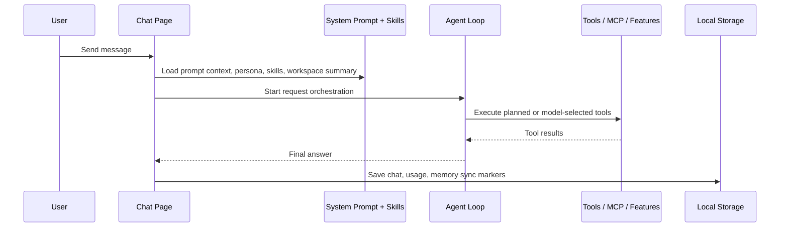

# 🏗️ Joanium Architecture

This doc explains how Joanium is assembled, what runs where, and how a request travels from the UI all the way to providers, tools, connectors, and persisted state.

## 1. 🧩 The Big Idea

Joanium is **not one big app file**. It's composed from discoverable pieces:

- workspace packages
- feature manifests
- engine definitions
- auto-discovered IPC modules
- auto-discovered services
- page manifests

This composition model is one of the repo's biggest strengths. New capabilities can be added as packages without touching a central registry. The boot layer finds them automatically.

## 2. 🗂️ Runtime Layers

| Layer | Main location | What it does |
|---|---|---|
| ⚡ Electron entry | `App.js` | Creates runtime dirs, seeds libraries, boots the app, creates the window, starts engines |
| 🔧 Main-process boot | `Packages/Main` | Discovery, dependency assembly, services, IPC registration, window creation |
| ⚙️ Features & engines | `Packages/Features` | Long-lived systems — agents, automations, connectors, channels, MCP, storage |
| 🔌 Capabilities | `Packages/Capabilities` | Integration-specific features — connectors, prompt context, chat tools, automation handlers |
| 🖼️ Renderer shell | `Packages/Renderer` | Page discovery, routing, sidebar wiring, modal setup |
| 📄 Renderer pages | `Packages/Pages` | The actual UI surfaces: chat, setup, automations, agents, skills, personas, etc. |
| 🛠️ Shared system | `Packages/System` | Shared contracts (`defineEngine`, `definePage`), shared state, prompt helpers, utilities |
| 💾 Local state | `Config`, `Data`, `Memories`, `Skills`, `Personas` | User config, runtime state, memory files, libraries, system prompt assets |

## 3. 🚀 Boot Sequence

Everything starts in `App.js`.

### What `App.js` does
- Sets Electron process flags
- Ensures runtime directories exist (creates them if missing)
- Seeds the skill and persona content libraries on first run
- Initialises personal memory markdown files
- Calls `boot()` from `Packages/Main/Boot.js`
- Starts engines after boot completes
- Creates the main window
- Auto-connects MCP servers

### What `Packages/Main/Boot.js` does
- Loads all feature manifests via `FeatureRegistry.load(...)`
- Discovers engines from declared engine roots
- Builds feature/engine storage handles via `createFeatureStorageMap(...)`
- Instantiates engines in dependency order (respects `needs` and `provides`)
- Runs feature lifecycle hooks like `onBoot`
- Discovers and registers IPC modules, auto-injecting services and engine context
- Returns the boot payload used by the rest of the app

### Boot flow



## 4. 🔍 Discovery Is the Backbone

Joanium uses workspace package manifests to declare discovery roots. The root `package.json` defines npm workspaces, and each workspace package can add a `joanium.discovery` section:

```jsonc
// Example: a capability package's package.json
{
  "name": "@joanium/my-capability",
  "private": true,
  "type": "module",
  "joanium": {
    "discovery": {
      "features": ["./Core"],   // Feature.js files
      "engines": ["./Core"],    // *Engine.js files
      "ipc": ["./IPC"],         // *IPC.js files
      "pages": ["."],           // Page.js files
      "services": ["./Services"] // *Service.js files
    }
  }
}
```

`WorkspacePackages.js` expands the workspace list. `DiscoveryManifest.js` collects discovery roots for each kind.

**The result:** Joanium grows by package composition. No hand-written central imports needed.

## 5. 🗃️ Feature Registry Composition

`Packages/Capabilities/Core/FeatureRegistry.js` is one of the most important files in the repo.

It loads every discovered `Feature.js`, sorts them topologically by `dependsOn`, and indexes everything each feature contributes.

### A feature can contribute any of these:
- 🔑 Service connectors (appear in setup UI)
- 🔓 Free connectors (no auth needed)
- 📄 Feature pages (appear in the sidebar)
- 🛠️ Renderer chat tools (callable during conversations)
- 📊 Automation data sources
- 📤 Automation output types
- 📝 Automation instruction templates
- 💬 Prompt context sections (injected into every system prompt)
- 🔄 Lifecycle hooks (`onBoot`, etc.)
- 💾 Storage descriptors

### Why this matters

A single capability package can plug into **multiple product surfaces at once**:

```
GitHub package contributes →
  ✅ Connector (setup UI)
  ✅ Chat tools (use GitHub mid-conversation)
  ✅ Automation data sources (poll new issues)
  ✅ Automation outputs (create PRs from automations)
  ✅ Prompt context (tells the assistant about connected repos)
```

That's why the feature registry is the center of product composition.

## 6. ⚙️ Engines: Long-Lived Runtime Behavior

Engines are discovered from `*Engine.js` files and normalised through `DefineEngine.js`.

### Current engines
- `Packages/Features/Agents/Core/AgentsEngine.js`
- `Packages/Features/Automation/Core/AutomationEngine.js`
- `Packages/Features/Channels/Core/ChannelEngine.js`
- `Packages/Features/Connectors/Core/ConnectorEngine.js`

### What engines do
- Load and persist their own state
- Start background timers or polling loops
- Expose runtime methods via injected context or IPC
- Coordinate with the renderer when human-facing execution is needed

### ⚠️ Important pattern: main ↔ renderer split

Not every agentic behavior runs fully in the main process. For example:

1. The agents engine schedules and dispatches work
2. The renderer-side gateway receives the request
3. The chat/agent loop performs model calls and tool orchestration
4. Results are sent back to the engine for persistence and history

This split lets Joanium reuse the same orchestration logic for both interactive chat and background agent runs.

## 7. 🌉 IPC and the Preload Bridge

Joanium uses Electron IPC for communication between the renderer and main process.

### Main-process IPC

`DiscoverIPC.js` scans `*IPC.js` files and calls each module's `register(...)` function. If a module declares `ipcMeta.needs`, the boot layer injects matching services or engines automatically.

```js
// Example IPC module
export const ipcMeta = { needs: ['agentsEngine'] };

export function register(agentsEngine) {
  ipcMain.handle('agents:list', () => agentsEngine.getAll());
  ipcMain.handle('agents:run', (_, id) => agentsEngine.run(id));
}
```

### Preload

`Core/Electron/Bridge/Preload.js` exposes two bridges to the renderer:

- `window.electronAPI` — generic IPC calls and events (desktop/runtime APIs)
- `window.featureAPI` — feature boot payload and feature method invocation

## 8. 🖼️ Renderer Architecture

The renderer shell starts in `Packages/Renderer/Application/Main.js`.

### What it does
- Discovers built-in pages from the main process
- Merges feature-contributed pages from the feature boot payload
- Builds the sidebar navigation
- Mounts and unmounts pages dynamically
- Initialises shared modals
- Initialises gateways for channels and scheduled agents

Pages are loaded by **manifest, not by a fixed router table**. `PagesManifest.js` builds the page map dynamically after discovery — same composability as the feature system.

## 9. 📄 Page Model

Each top-level page typically has:

```text
MyPage/
  Page.js              ← manifest (id, label, icon, order, moduleUrl)
  *.html               ← shell entry (when needed)
  UI/Render/index.js   ← page mounting logic
  UI/Styles/*.css      ← styles
  Components/          ← reusable UI components
  Features/            ← page-specific logic
  State/               ← local state management
```

Current built-in pages: **Chat · Setup · Automations · Agents · Skills · Marketplace · Personas · Events · Usage**

Feature packages can contribute additional pages through the feature registry boot payload.

## 10. 💬 Chat Request Lifecycle

The chat page is the center of the UX and also the shared orchestration layer for background features.

### Step by step

1. User writes a message
2. Renderer loads providers, skills, workspace state, and system prompt context
3. The request planner optionally selects skills and pre-plans tool calls
4. The agent loop executes model calls, tool calls, fallbacks, browser steps, sub-agent coordination
5. Tool execution delegates to local capabilities, terminal/workspace tools, MCP, or feature handlers
6. The final answer is rendered in chat
7. Chat history, usage, and memory sync state are persisted locally



## 11. 📝 Prompt Assembly

The runtime system prompt is built from **multiple sources** every time, not one static file.

| Source | What it contributes |
|---|---|
| `SystemInstructions/SystemPrompt.json` | Base assistant instructions |
| `Config/User.json` | User profile (name, preferences) |
| Active persona markdown | Persona behavior and personality |
| Feature prompt hooks | Connected service summaries (e.g. "GitHub is connected, here are your repos") |
| `Instructions/CustomInstructions.md` | Your own custom instructions |
| Runtime metadata | Current date, time, platform, hardware |

**Key takeaway:** Changing a persona, adding a connector, or editing custom instructions all affect the assistant's behavior without touching the core chat loop.

## 12. 💾 Persistence Model

Joanium is intentionally **local-first**.

| Mode | State root |
|---|---|
| Development | Repo root |
| Packaged builds | Electron `userData` |

Everything — chats, projects, usage data, connector state, MCP config, agent state, skills, persona, custom instructions, personal memory — lives in predictable local files.

> ⚠️ In dev mode, runtime state can show up in `git status`. Be careful before committing.

See [Data-And-Persistence.md](Data-And-Persistence.md) for the full storage map.

## 13. 💡 Architectural Strengths

- **Discovery-based composition** — adding new capabilities is cheap; no central file to edit
- **Feature registry composition** — one package can plug into connectors, tools, automations, prompts, and pages simultaneously
- **Engine separation** — background runtimes stay out of the page layer
- **Renderer page discovery** — the shell is extensible without hardcoding routes
- **Local-first state** — everything is inspectable, hackable, and yours
- **Markdown-based skills and personas** — easy to author, share, and version

## 14. ⚠️ Watch Out For

- Dev mode writes state into the repo root — watch your commits
- Some user flows span main process + preload + renderer shell + a page-specific feature folder simultaneously
- Chat orchestration is broad — changes there affect chat, scheduled agents, channel replies, and tool behavior all at once
- Feature storage keys must be unique across both features and engines
- Discovery relies on consistent file naming conventions (`Feature.js`, `*Engine.js`, `*IPC.js`, `Page.js`, `*Service.js`)

→ For practical maintenance guidance, see [Where-To-Change-What.md](Where-To-Change-What.md).
